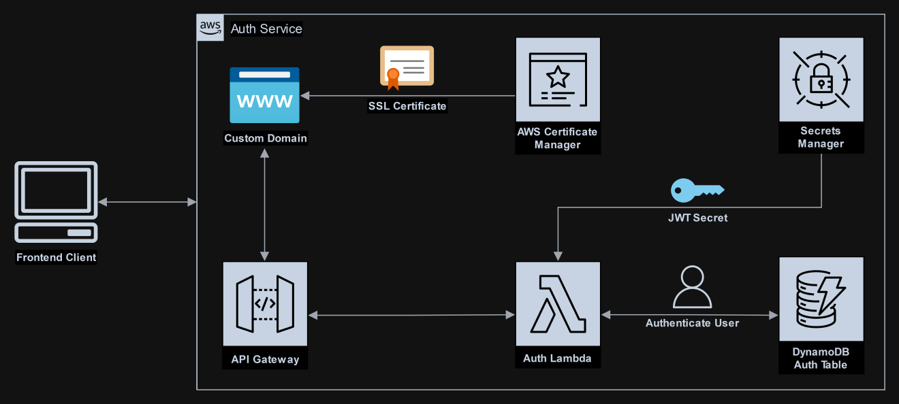

<style>
    .highlight > pre, figure {
        margin:0 !important;
    }
</style>


I'm planning on creating demo projects and I needed an auth service.  
Instead of creating a seperate auth logic in each project I decided to create a simple serverless JWT auth service to use in all projects.  
I have deployed it on AWS cloud with lambda and dynamodb using a self-hosted Gogs and Jenkins CI/CD.

## Features

-   Each project has its own "domain" with its JWT secret and users.
-   The JWT secrets can be easily rotated using AWS Secrets Manager built-in features with a simple lambda function.

## In plan features

-   Use public-private secret keys instead of a simple JWT secret string.
-   Comply with OAuth2 specifications.
-   Create an option for other services to check if user session is still valid.

## GitHub Repository




This is a POC and shouldn't be used in production as it is **NOT** protected against attacks.


## API Flow

### Authentication

1. Client sends a POST to `/login` with json body, example:

```json
{
    "domain":"demo",
    "username":"demo",
    "password":"password"
}
```

2. Lambda extracts JWT secrets from secrets manager and if specified domain exists continues, otherwise responds with invalid domain error.
3. Lambda checks if user exists in dynamodb and password is correct, otherwise responds with an invalid username or password error.
4. Lambda signs a JWT token using the domain secret and sends it to the client.
-   The JWT token contains the domain, username, session id and refresh token in the body.

### Token refreshing

1. Client sends a GET to `/refresh` specifying the token in the Authorization header.
2. Lambda extracts the session & refresh tokens from JWT and checks if both are still valid.
3. Lambda creates and signs a new JWT token.

### Authorization

1. Client sends a request to a service specifying the jwt token as bearer token in the Authorization header
2. Service gets its JWT secret from AWS Secrets Manager and checks if provided JWT token is valid.
3. `OPTIONAL` On critical operations the service can check in dynamodb if session is still valid.


## CI/CD
Jenkins is running in a docker container and there is a caviat with that aproach which I will explain later.  
Secrets Manager and DynamoDB are emulated locally using Localstack.  
For running the integration tests I run the lambda and api gateway locally with AWS SAM.  
`NOTE:` AWS SAM is using docker to run lambda locally in containers.

### Tools

-   [**Gogs**](https://gogs.io/) - Self-hosted remote git repository, used to host the service's code.
-   [**Jenkins**](https://www.jenkins.io/) - CI/CD pipeline tool, used to automate code testing and deployment.
-   [**AWS Serverless Application Model (SAM)**](https://aws.amazon.com/serverless/sam/) - AWS open-source tool which is using Cloudformation under the hood to manage serverless applications, used to locally test and deploy the code to the cloud.
-   [**Localstack**](https://localstack.cloud/) - A localy hosted AWS cloud emulation for testing.

### Flow

1. When code is pushed into the master branch, Gogs sends a webhook into Jenkins.
2. Jenkins pulls the latest changes and starts the pipeline.
3. Pipeline runs unit tests and integration tests using AWS SAM as a local deployment and Localstack as an emulation for the Secrets Manager and DynamoDB.
4. If the tests passed without failing the pipeline uses AWS SAM to deploy the Cloudformation template and the code.

### Jenkinsfile
I will show the important parts here, if you want to see the full Jenkins file:  
[Complete Jenkinsfile on GitHub](https://github.com/Nikxy/lambda-auth/blob/master/Jenkinsfile)

For integration testing I use Localstack as an AWS emulation for the secrets manager and dynamodb and AWS SAM for running lambdas and api gateway locally.  
Before testing it should be running and populated with test data. Later I plan to implement localstack checks and population into the Jenkinsfile.

#### Dependencies
Check if the dependencies exist and write that to a variable to install in the pipeline.

```groovy
environment {
    // Check if node_modules exists
    TEST_NODE_MODULES_EXISTS = fileExists 'node_modules'
    SRC_NODE_MODULES_EXISTS = fileExists 'src/node_modules'
    // Check if AWS SAM exists
    AWS_SAM_EXISTS = fileExists 'venv/bin/sam'
```

#### AWS settings
AWS SAM is using CloudFormation under the hood, so we need to specify the stack name for the deployment and S3 bucket for template and code upload.

```groovy
    // AWS Settings
    AWS_REGION = 'il-central-1'
    AWS_STACK_NAME = 'auth-service'

    // SAM uploads template and code to the specified S3 bucket
    AWS_S3_BUCKET = 'my-cloudformation-bucket'
    AWS_S3_PREFIX = 'auth-service'
}
```

Those settings leads to the following objects in the s3 bucket:

```shell
S3://my-cloudformation-bucket
└── auth-service
    ├── ****.template # CloudFormation template file
    └── ************* # Zip archive of the code
```

`NOTE` Each deployment a new object is created for the modified template or code.

#### Integration Testing with AWS SAM

Start sam in the background and log the output to sam.log:

```shell
nohup venv/bin/sam local start-api \
--parameter-overrides \
    ParameterKey=EnvironmentType,\
    ParameterValue=test \
--warm-containers EAGER \
--container-host 172.17.0.1 --container-host-interface 0.0.0.0 \
--region ${AWS_REGION} -v /PATH_TO_WORKSPACE_ON_HOST \
> $WORKSPACE/sam.log 2>&1 &
```

Because Jenkins is running in a docker container we need to specify some arguments.

* Install docker cli in Jenkins image and mount the docker socket for the Jenkins container

```yaml
- /var/run/docker.sock:/var/run/docker.sock
```

* Set the ip of the docker interface with --container-host and --container-host-interface to 0.0.0.0 to allow SAM to access the lambda container.

* Also we need to setup the path to the code from the context of the docker host, for this I mounted a folder from the host to Jenkins workspaces folder and specified its path with the -v argument.

Wait for AWS SAM to finish initializing:

```shell
#!/bin/bash
# Check if last line of sam log contains CTRL+C
while [[ $(tail -n 1 sam.log) != *"CTRL+C"* ]]
    do echo "waiting for sam" && sleep 1
done
```
Run the integration tests:

```groovy
def exitStatus =
    sh returnStatus: true, script: 'npm run test_ci:integration'
junit 'junit-integration.xml'
if (exitStatus != 0) {
    error 'Integration tests failed'
}
```

#### Deployment
After all tests were passed we deploy the code using the same AWS SAM:

```groovy
withCredentials([usernamePassword(
    credentialsId: 'AWSJenkinsDeploy',
    usernameVariable: 'AWS_ACCESS_KEY_ID',
    passwordVariable: 'AWS_SECRET_ACCESS_KEY'
)]) {
    sh 'venv/bin/sam deploy --stack-name ${AWS_STACK_NAME} \
        --region ${AWS_REGION} --no-progressbar \
        --s3-bucket ${AWS_S3_BUCKET} --s3-prefix ${AWS_S3_PREFIX} \
        --on-failure ROLLBACK --capabilities CAPABILITY_NAMED_IAM'
}
```
* Use Jenkins credentials for AWS access key.
* Specify --no-progressbar for less output to the pipeline console.
* Specify --capabilities to enable creation of named IAM role specified in the CloudFormation template.


## Summary
This is my first project on AWS, I used it as a learning ground for my AWS Certification and Jenkins.  
I learned a lot while creating it and excited to learn and use the AWS cloud and Jenkins.  
For future projects I plan to use also AWS's CI/CD with CodePipeline.